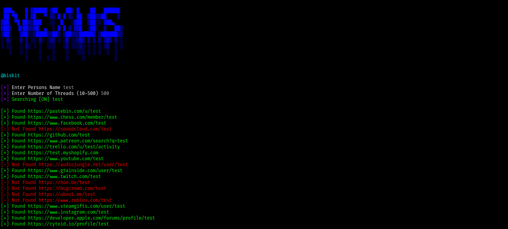

<p align="center">
  
</p>


```bash

How To install: git clone https://github.com/biskit069/Nexus

cd Nexus

pip3 install -r requirements.txt

How To Run: python3 nexus.py

if you are running 8.8.8.8 or 1.1.1.1 dns it will block the duckduckgo links
