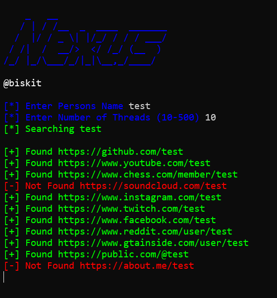

<p align="center">
  
</p>


```bash

How To install:

git clone https://github.com/vbiskit/Nexus

cd Nexus

pip3 install -r requirements.txt

How To Run: python3 nexus.py

if duckduckgo isn't working it may be the public dns

