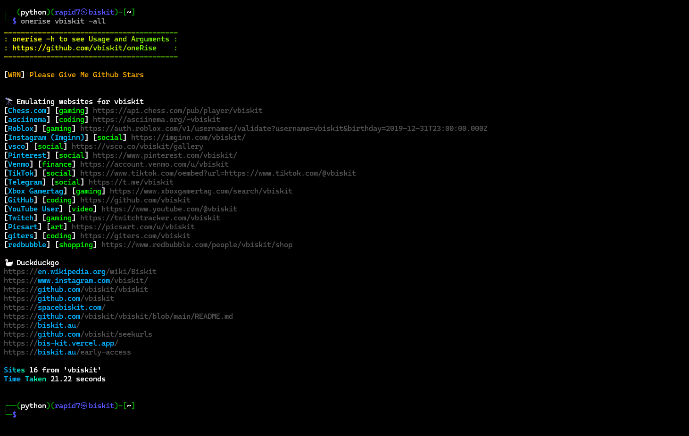

# oneRise


# About this tool

The tool has 0 false postives its a fast username or can be real name search what i mainly use this stuff for it has a built in duckduckgo search and a brute force username runs fron a .txt so does the duckduckgo brute force.

## Installation 
Clone the repository and install the required dependencies:  
```
git clone https://github.com/vbiskit/oneRise

cd oneRise

pip3 install -r requirements.txt

chmod +x onerise.py

sudo mv onerise.py /usr/local/bin/onerise

onerise
```
# Usage:
```
Arguments:
  -sf  Save the output to a file
  -bf brute-force usernames from a .txt file
  -all Search With Duckduckgo And Userlinks
  -bd brute-force usernames with duckduckgo
  -bf name,name2
  -bd name,name2
Usage:
  - python3 onerise.py <example> -sf example.txt
  - python3 onerise.py <example> for just links
  - python3 onerise.py -bf usernames.txt
  - python3 onerise.py <example> -all
  - python3 onerise.py -bd example.txt
  - python3 onerise.py example -all -sf some.txt
  - python3 onerise.py -bf name,name2
  - python3 onerise.py -bd name,name2
  - python3 seekurls.py example -all -sf some.txt
  - python3 seekurls.py -bf name,name2
  - python3 seekurls.py -bd name,name2
