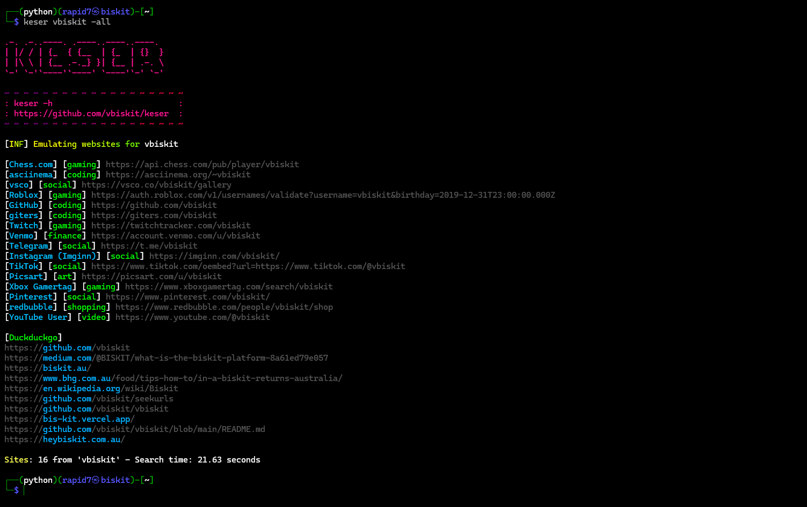

# hello
```yaml
Please Give Me GithHub Stars.
```
## Description
**everything you need in a username tool very fast 0 false positives searches through over 670 sites**



## Installation 
Clone the repository and install the required dependencies:  
```yaml
git clone https://github.com/vbiskit/keser

cd keser

pip3 install -r requirements.txt

cd

echo 'export PATH="$HOME/keser:$PATH"' >> ~/.bashrc && source ~/.bashrc

chmod +x ~/keser/keser.py

mv ~/keser/keser.py ~/keser/keser
```
## Run the tool:
```yaml
keser
```
## keser -h

```yaml
Arguments:
  -sf  Save the output to a file
  -bf brute-force usernames from a .txt file
  -all Search With Duckduckgo And Userlinks
  -bd brute-force usernames with duckduckgo
  -bsn brute-force similar names
  -bf name,name2
  -bd name,name2
  -bsn search similar names of that user
Usage:
   keser <example> -sf example.txt
   keser <example> for just links
   keser -bf usernames.txt
   keser <example> -all
   keser -bd example.txt
   keser example -all -sf some.txt
   keser -bf name,name2
   keser -bd name,name2
   keser -bsn <user>
```
## can't install tool because of error: externally-managed-environment fix in 14 seconds.
```yaml
sudo apt install virtualenv

virtualenv python

cd python

source bin/activate
```
**now you can install and run the tool just follow the steps here**
https://github.com/vbiskit/keser/blob/main/README.md#installation

# how to uninstall the tool:
```yaml
rm -rf keser
