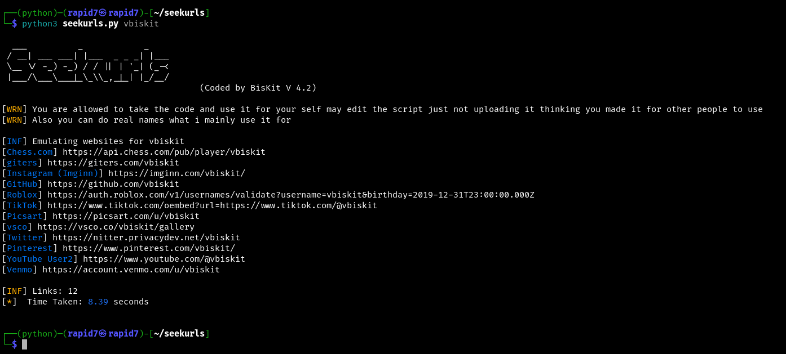
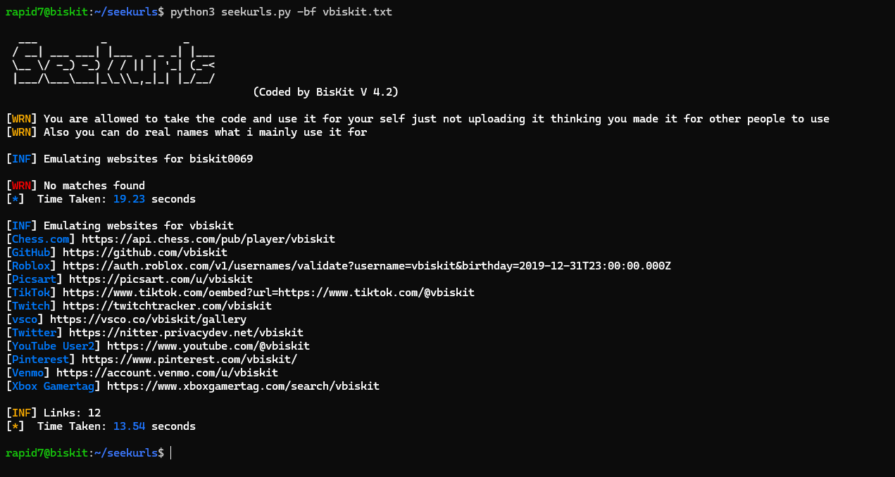
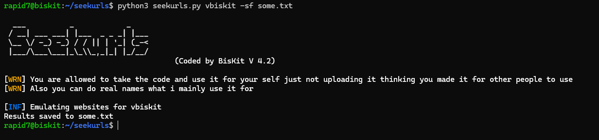
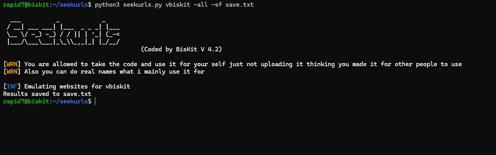
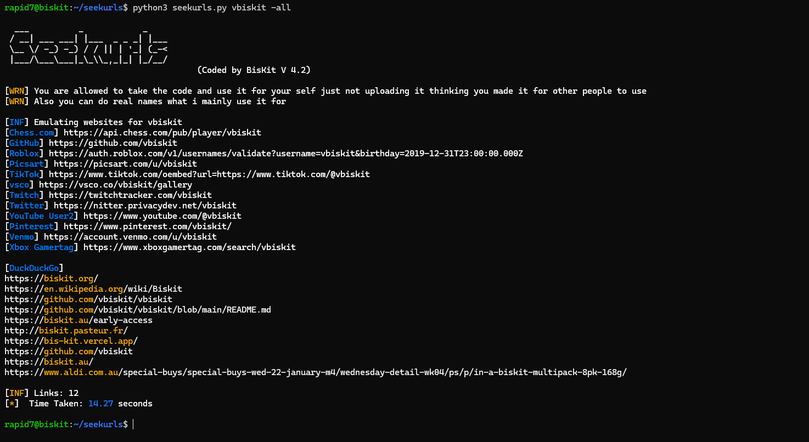

# Really Fast Normal Search


## 
The tool has 0 false postives so just letting you know its a insanely fast username or can be real name search what i mainly use this stuff for it has a built in duckduckgo search and a brute force username runs fron a .txt so does the duckduckgo brute force.

# Brute Force: Usernames


# Save File 


# Save file with all links



# Duckduckgo Brute Force Usernames


## Installation 
Clone the repository and install the required dependencies:  
```
git clone https://github.com/vbiskit/seekurls

cd seekurls

pip3 install -r requirements.txt

python3 seekurls.py
```
# Usage:
```
Arguments:
  -sf  Save the output to a file
  -bf brute-force usernames from a .txt file
  -all Search With Duckduckgo And Userlinks
  -bd brute-force usernames with duckduckgo
Usage:
  - python3 seakurls.py <example> -sf example.txt
  - python3 seakurls.py <example> for just links
  - python3 seakurls.py -bf usernames.txt
  - python3 seakurls.py <example> -all
  - python3 seakurls.py -bd example.txt
  - python3 seekurls.py example -all -sf some.txt
