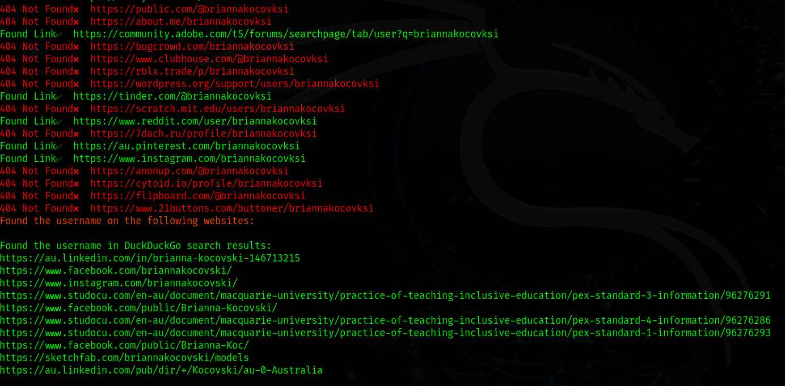

# userfinder Very Fast Osint Username Search 

## About  

I created userfinder to make my work easier and to help others save time when searching for usernames. Many existing tools are either too slow or lack efficiency, so I built userfinder to deliver faster and more reliable results. By outperforming other tools and integrating DuckDuckGo search, userfinder provides a powerful and privacy-friendly way to find usernames or first name and last names with speed and accuracy. 

## Installation  

Clone the repository and install the required dependencies:  
```
git clone https://github.com/vbiskit/userfinder

cd userfinder

pip3 install -r requirements.txt

python3 userfinder.py
```
# Usage:
```
python3 userfinder.py someone -sf user.txt

python3 userfinder.py someone 
