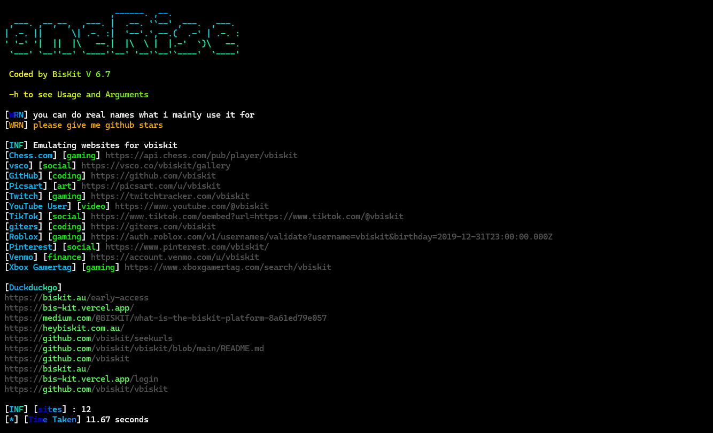
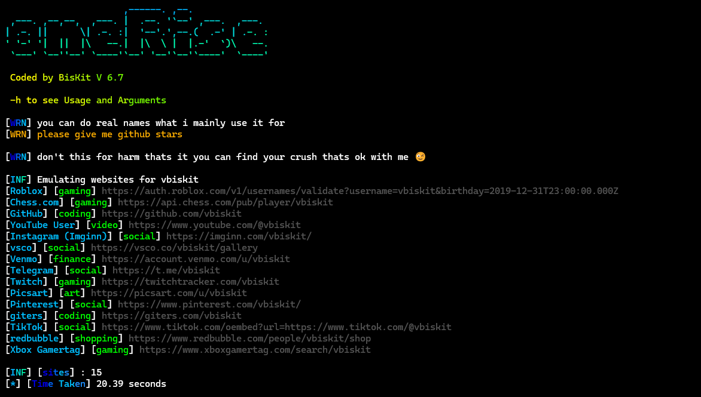
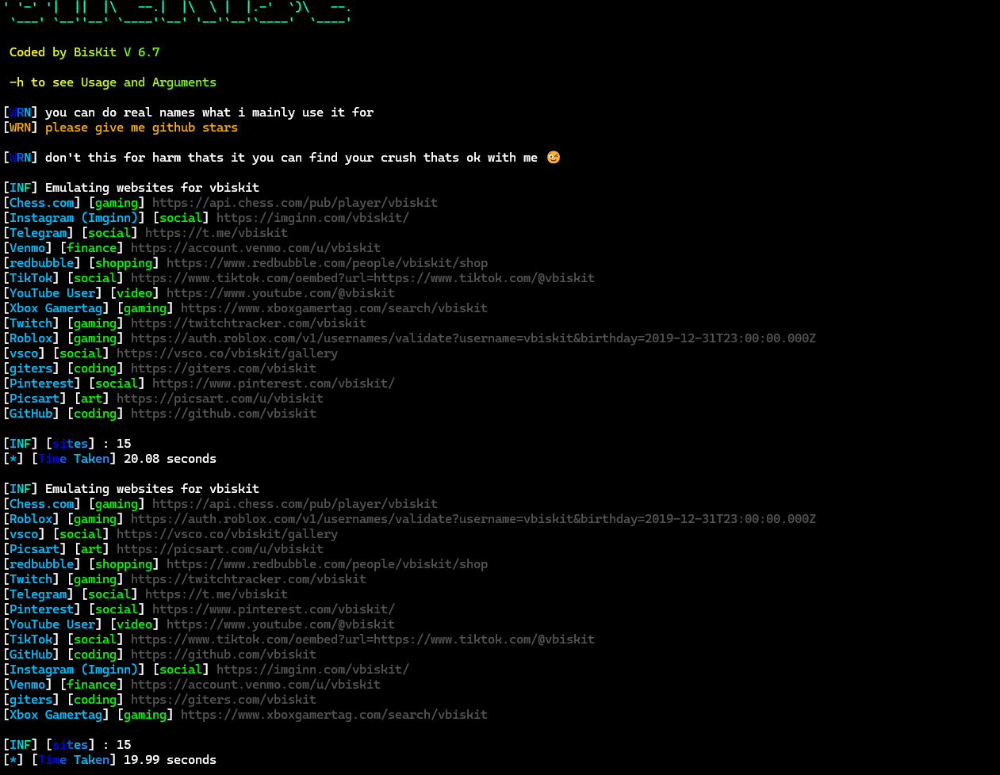
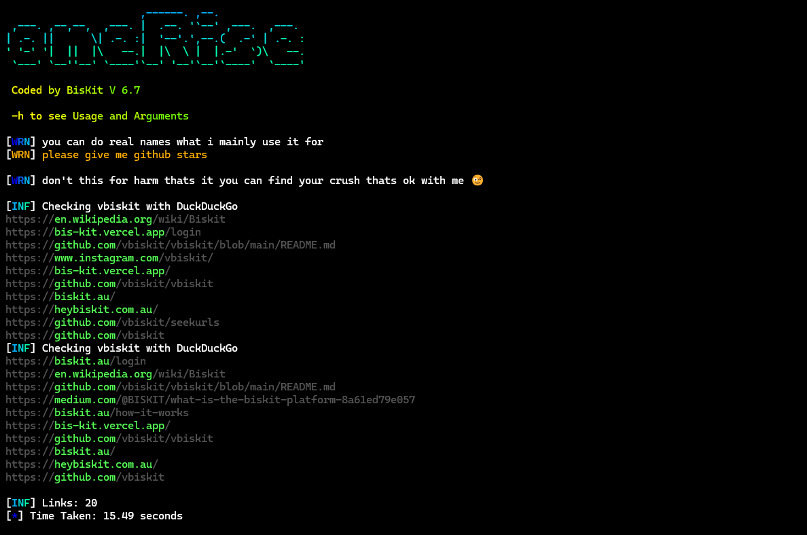
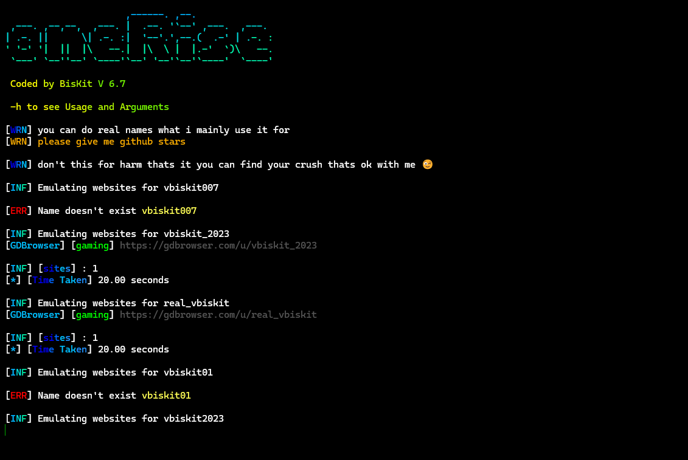

## showcase of the tool using -all Flag for duckduckgo and user links



## default usersearch with no flags 



## user brute force -bd Flag 



## duckduckgo brute force -bd Flag



## search similar names of that user -bsn Flag



## About this tool

The tool has 0 false postives its a very fast username or can be real name search what i mainly use this stuff for it has a built in duckduckgo search and a brute force username runs fron a .txt so does the duckduckgo brute force,: its also scans through 676 sites

## Installation 
Clone the repository and install the required dependencies:  
```yaml
git clone https://github.com/vbiskit/oneRise

cd oneRise

pip3 install -r requirements.txt

cd

sudo mv oneRise /usr/local/bin/

sudo chmod +x /usr/local/bin/oneRise/onerise.py

sudo ln -s /usr/local/bin/oneRise/onerise.py /usr/local/bin/onerise
```
## Run the tool:
```yaml
onerise
```
## onerise -h

```yaml
Arguments:
  -sf  Save the output to a file
  -bf brute-force usernames from a .txt file
  -all Search With Duckduckgo And Userlinks
  -bd brute-force usernames with duckduckgo
  -bsn brute-force similar names (e.g., vbiskit -> biskit, biskit069)
  -bf name,name2
  -bd name,name2
  -bsn search similar names of that user
Usage:
  - python3 onerise <example> -sf example.txt
  - python3 onerise <example> for just links
  - python3 onerise -bf usernames.txt
  - python3 onerise <example> -all
  - python3 onerise -bd example.txt
  - python3 onerise example -all -sf some.txt
  - python3 onerise -bf name,name2
  - python3 onerise -bd name,name2
  - python3 onerise -bsn <user>
```
## can't install tool because of error: externally-managed-environment fix in 14 seconds.
```yaml
sudo apt install virtualenv

virtualenv python

cd python

source bin/activate
```
**now you can install and run the tool just follow the steps here**
https://github.com/vbiskit/oneRise/tree/main?tab=readme-ov-file#installation

# how to uninstall the tool:
```yaml

rm -rf oneRise

sudo rm -rf /usr/local/bin/oneRise

sudo rm -rf /usr/local/bin/oneRise/onerise.py

sudo rm -rf /usr/local/bin/onerise
