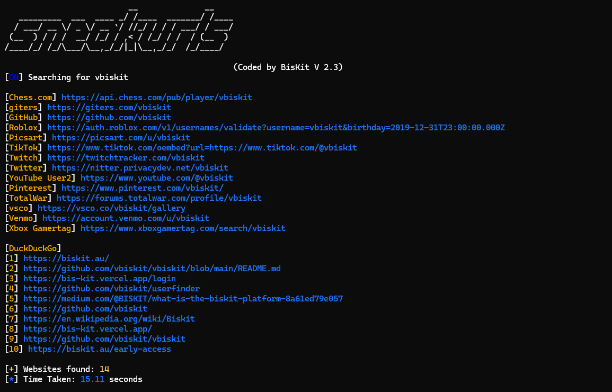
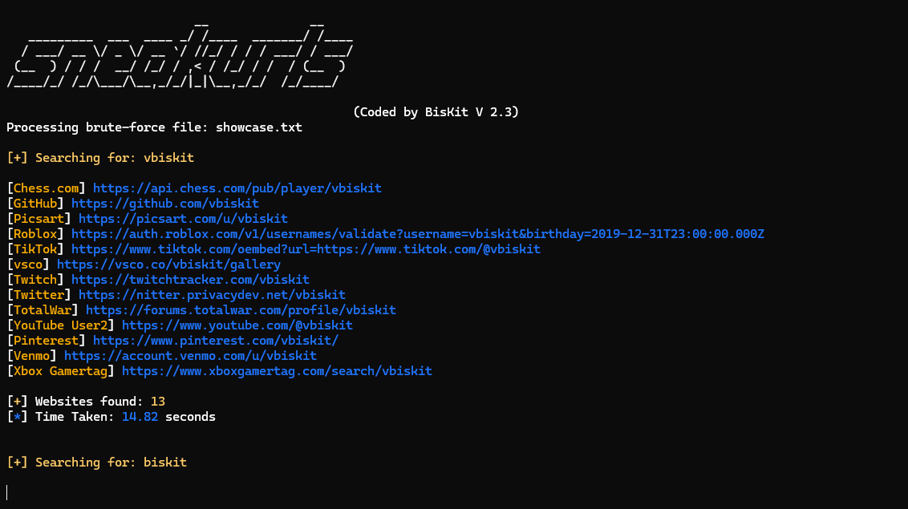
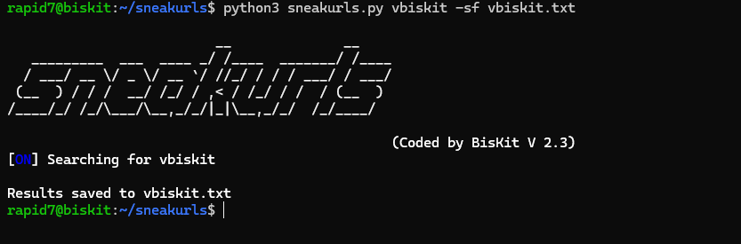

# Duckduckgo And Links -all 


## Results time 

if you got good internet might take 10 to 8 seconds

# Brute Force: Usernames -bf


# Save File -sf


## Installation 
Clone the repository and install the required dependencies:  
```
git clone https://github.com/vbiskit/sneakyurls

cd sneakyurls

pip3 install -r requirements.txt

python3 sneakyurls.py
```
# Usage:
```
Arguments:
  -sf  Save the output to a file
  -bf brute-force usernames from a .txt file
  -all Search With Duckduckgo And Userlinks
  -bd brute-force usernames with duckduckgo
Usage:
  - python3 seakurls.py <example> -sf example.txt
  - python3 seakurls.py <example> for just links
  - python3 seakurls.py -bf usernames.txt
  - python3 seakurls.py <example> -all
  - python3 seakurls.py -bd example.txt
